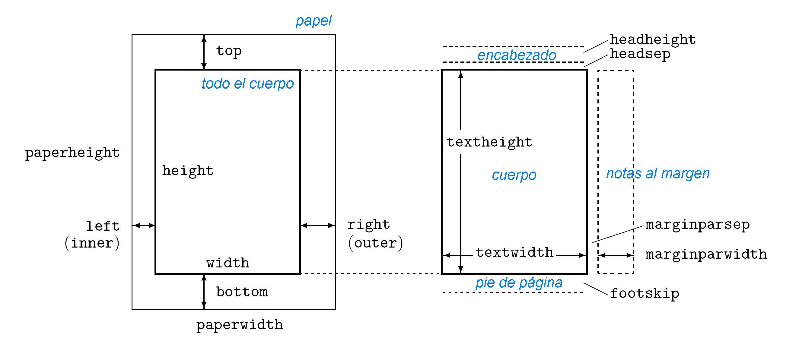

Formatos de página y de textos
========================================

Introducción a la documentación
---------------------------------------------------------

Paquete geometry
---------------------------------------------------------

Este paquete proporciona una interfaz flexible y sencilla para las dimensiones de la página. Puede cambiar el diseño de la página con parámetros intuitivos. 

La estructura general del código se introduce en el preámbulo

.. code-block:: latex
    :caption: option.tex
    :name: option-tex
    :linenos:

    \usepackage[<option 1>, 
                <option 2>,
                ...
                <option n>]{geometry}
                
donde las ``<option n>`` son opciones. Las opciones básicas son las que muestran la siguiente figura

.. _target to image:

    dimensiones del diseño

La :ref:`target to image` muestra las :ref:`paper_geometry` de página definidas en el paquete ``geometry``. El diseño de la página contiene un ``total body`` (área imprimible) y \ márgenes. El ``total body`` consta de un cuerpo (área de texto) con un ``header``, ``footer`` y notas marginales (marginpar) opcionales. Hay cuatro márgenes: ``left``, ``right``, ``top`` y ``bottom``. Para documentos de dos caras, los márgenes horizontales deben llamarse ``inner``y ``outer``.
  
Entonces, este paquete permite especificar los 4 márgenes sin necesidad de recordar los comandos de dimensiones de página particulares.
  
Como ejemplo, este documento usa los siguiente comandos

.. note::
    - El paquete ``showframe`` genera los cuadros o cajas del texto, encabezado, nota al margen y al pie de página.
 
.. code-block:: latex
    :caption: marginparwidth.tex
    :name: marginparwidth-tex
    :linenos:

    \usepackage{showframe}
    \usepackage[top=2cm, 
                bottom=2cm, 
                left=4cm, 
                right=4cm,
                marginparwidth=2cm]{geometry}

Cada margen se mide desde el borde correspondiente de un papel. Por ejemplo, margen izquierdo (margen interior) significa una distancia horizontal entre el borde izquierdo (interior) del papel y el del cuerpo total. Por lo tanto, los márgenes izquierdo y superior definidos en geometría son diferentes de las dimensiones nativas ``\leftmargin`` y ``\topmargin``. 

El tamaño de un cuerpo (área de texto) se puede modificar mediante ``\textwidth`` y ``\textheight``. Las dimensiones para papel, cuerpo total y márgenes tienen las siguientes relaciones:

.. code-block:: latex
    :caption: paperwidth.tex
    :name: paperwidth-tex
    :linenos:
    
    paperwidth = left + width + right
    paperheight = top + height + bottom

También puede ingresar las medidas en centímetros y pulgadas. Uso :math:`cm` para centímetros y :math:`mm` para milimetros después de cada valor ( por ejemplo :math:`254mm` o :math:`2,54cm`). 
     
Por ejemplo, si desea establecer un margen de :math:`2cm` desde cada borde del papel, puede escribir solo
 
.. code-block:: latex
    :caption: margin.tex
    :name: margin-tex
    :linenos:

    \usepackage[margin=2cm]{geometry}

Formato de tamaños y fuentes.
----------------------------------------------------
Paquete ``anysize``
----------------------------------------------------

El paquete ``anysize`` es un paquete :math:`\LaTeX{}` que establece el tamaño del papel y los márgenes de un documento. Estos ajustes se realizan con un simple comando.

Estructura básica
~~~~~~~~~~~~~~~~~~~~~

Hay que añadir en el preámbulo 

.. code-block:: latex
    :caption: anysize.tex
    :name: anysize-tex
    :linenos:
    
    \usepackage{anysize}  

El estilo conoce opciones para definir el tamaño del papel (``a4paper``, ``a5paper``, etc.) y una opción adicional ``germanpar``, que cambia los márgenes de los párrafos en el documento en particular.

Después de la inclusión de anysize, hay dos nuevos comandos disponibles para el preámbulo del documento:

.. code-block:: latex
    :caption: papersize.tex
    :name: papersize-tex
    :linenos:
    
    \papersize{width}{height}

establece el tamaño del papel. Este comando ya no debe usarse, ya que hay opciones de estilo estandarizadas para que los tamaños de papel estándar se pasen a través del comando ``\documentclass``  en el encabezado del documento.

El más usado es 

.. code-block:: latex
    :caption: marginsize.tex
    :name: marginsize-tex
    :linenos:
    
    \marginsize{left}{right}{top}{bottom}

establece los tamaños de los márgenes. Esto es lo realmente interesante de todo. En los documentos de dos caras, los márgenes izquierdo y derecho son los de los rectos. Para las espaldas, se intercambian.

Formato de párrafo.
----------------------------------------------------

Entornos y listas.
----------------------------------------------------

Encabezados y pies de página.
----------------------------------------------------

Uso del Lorem ipsum.
----------------------------------------------------

``lipsum`` es un paquete :math:`\LaTeX{}` que produce texto ficticio, de hasta $150$ párrafos y es utilizado en documentos de prueba o ejemplos. 
    
En la comunidad se lo conoce como *Lorem Ipsum* y es simplemente el texto de relleno de las imprentas y archivos de texto. Lorem Ipsum ha sido el texto de relleno estándar de las industrias desde el año 1500, cuando un impresor (N. del T. persona que se dedica a la imprenta) desconocido usó una galería de textos y los mezcló de tal manera que logró hacer un libro de textos especimen. No sólo sobrevivió 500 años, sino que tambien ingresó como texto de relleno en documentos electrónicos, quedando esencialmente igual al original. Fue popularizado en los 60s con la creación de las hojas "Letraset", las cuales contenian pasajes de Lorem Ipsum, y más recientemente con software de autoedición, como por ejemplo Aldus PageMaker, el cual incluye versiones de *Lorem Ipsum*.

Bien básico
~~~~~~~~~~~~~~~~~~~~~~~~~~~~~~~~~~~~~~~~~~

Hay que añadir en el preámbulo: 

.. code-block:: latex
    :caption: paquete_lorem_ipsum.tex
    :name: paquete_lorem_ipsum-tex
    :linenos:
    
    \usepackage{lipsum}   

En el cuerpo del documento,

.. code-block:: latex
    :caption: uso_de_lorem_ipsum.tex
    :name: uso_de_lorem_ipsum-tex
    :linenos:
    
    \lipsum[a]

donde la letra ``a`` indica el numero párrafo que se quiere introducir en el texto, pero solo uno de ellos. Por ejemplo, 

.. code-block:: latex
    :caption: ejemplo_lorem_ipsum.tex
    :name: ejemplo_lorem_ipsum-tex
    :linenos:
    :emphasize-lines: 6
    
    \documentclass[a4paper,12pt]{article}
    \usepackage[utf8]{inputenc}
    \usepackage[spanish]{babel}
    \usepackage{lipsum}
    \begin{document}
        \lipsum[3]
    \end{document}

Si queremos introducir más párrafos podemos usar siguiente comando

.. code-block:: latex
    :caption: parrafos_lorem_ipsum.tex
    :name: parrafos_lorem_ipsum-tex
    :linenos:
    
    \lipsum[a-b]

donde ``a-b`` es un *rango*, que básicamente, consiste de dos números separados por un guión ``(-)``, cuyo valor de ``a`` es el inicio y ``b`` es la finalización de párrafos.

.. note::

    Si bien es sintácticamente correcto, ``lipsum`` (y los comandos relacionados) pueden fallar si ``b`` es menor que ``a``. También falla si no introducimos el valor de ``a``.

Existe un comando estandar,  ``\lipsum,`` donde genera los primeros :math:`7` párrafos del texto ficticio, que es equivalente a ``\lipsum[1-7]``. 

Termino esta sección, mostrando que también podemos seleccionar oraciones del rango de párrafos sentenciados. El comando es

.. code-block:: latex
    :caption: oraciones_de_parrafos.tex
    :name: oraciones_de_parrafos-tex
    :linenos:
    
    \lipsum[c-d][a-b]

donde, análogo al caso anterior, ``c-d`` indica el rango de oraciones pero correspondientes al rango de párrafos Por ejemplo, 

.. code-block:: latex
    :caption: ejemplo_rango_de_parrafos.tex
    :name: ejemplo_rango_de_parrafos-tex
    :linenos:
    :emphasize-lines: 6-8
    
    \documentclass[a4paper,12pt]{article}
    \usepackage[utf8]{inputenc}
    \usepackage[spanish]{babel}
    \usepackage{lipsum}
    \begin{document}
        \lipsum[3]
        \lipsum[3-5]
        \lipsum[1-20][3-5]
    \end{document}

Existe un paquete mas general para producir, por ejemplo, listas o ecuaciones ficticias llamada ``blindtext``.